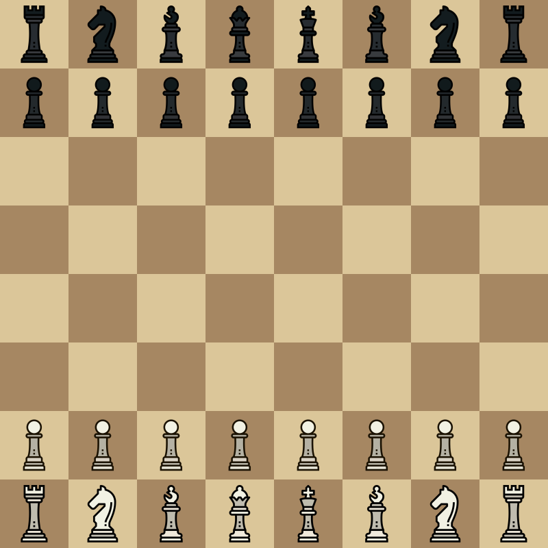
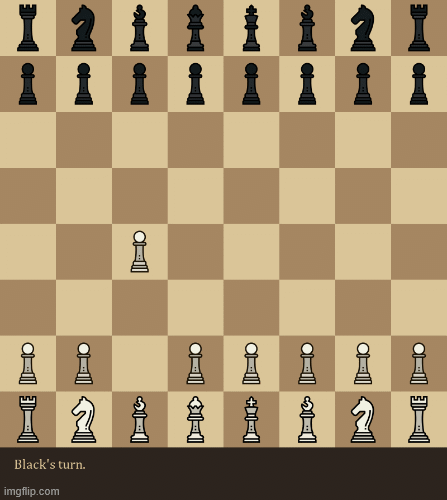
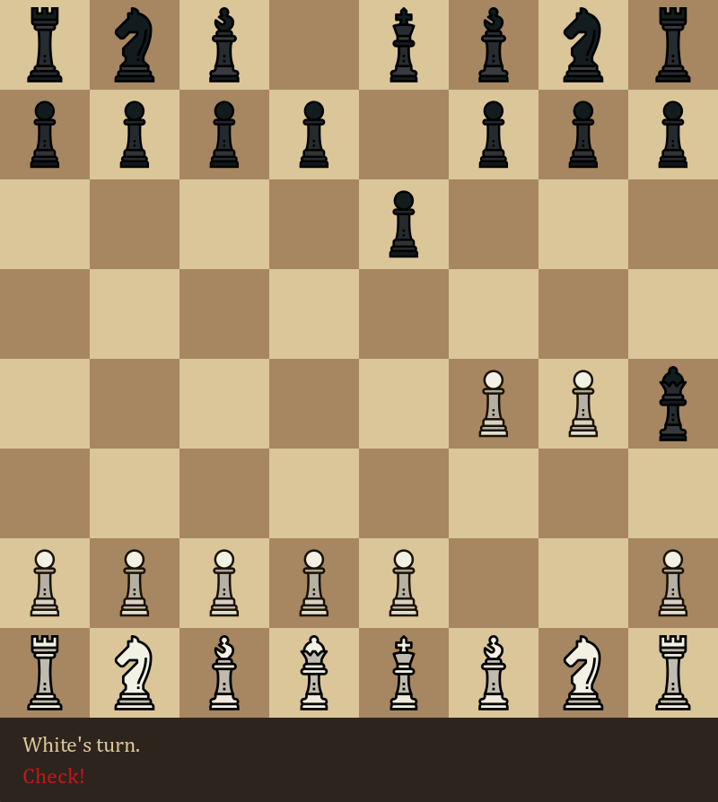

## Python Developer Capstone Project - Natalie Tong
This program was created independently in Python as part of the Python Developer Capstone Project. This project demonstrates a comprehensive understanding of Python as well as experience in Python modules such as pygame. 



# PyChess
This chess game was created with the Python module pygame, which creates a graphical interface for the game. The chess piece icons for this program were created by smalllikeart on Flaticon and modified slightly for the purposes of this game. The color designs of the chess pieces, the chess board, and the user interface are original.



## How to play
The game is played with only the mouse. When it is the player's turn, clicking on a chess piece on the board will select it, and the player can then click on any available location to move the piece or capture an enemy piece as long as it is a valid move for the piece type. After the player's turn is completed, it becomes the opponent's turn; the game alternates turns between the players until a checkmate condition has been reached and the game concludes.



## Installation instructions
To clone this repository, open a Git Bash terminal and use the following command:
```
git clone https://github.com/natalie-tong/Python-Developer-Capstone
```
This creates a local clone of the repository on your machine.

The program requires importing the pygame module and the sys module. 

Before installing pygame, Python must be installed on your machine. pip must also be installed, though it is generally pre-installed with Python. The pygame module can be installed by using the following command:
```
pip install pygame
```
For more information, visit https://pypi.org/project/pygame/.

To run the program, use the following command: 
```
python chess.py
```

# Credits
<a href="https://www.flaticon.com/free-icons/chess" title="chess icons">Chess icons created by smalllikeart - Flaticon</a>
